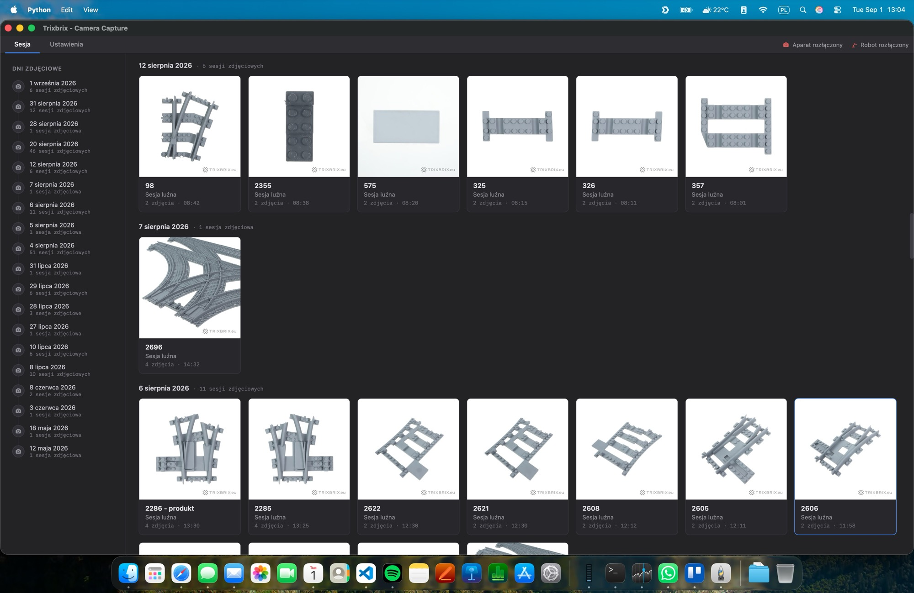
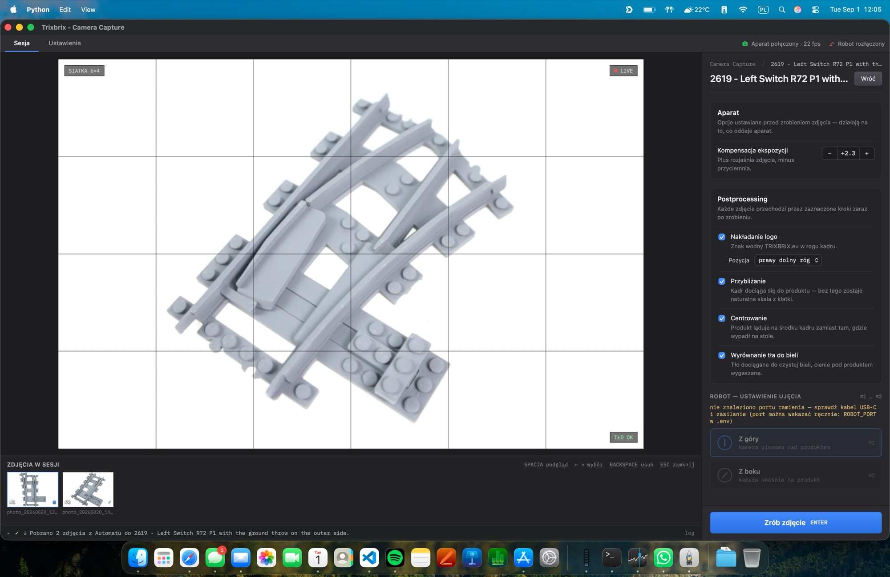
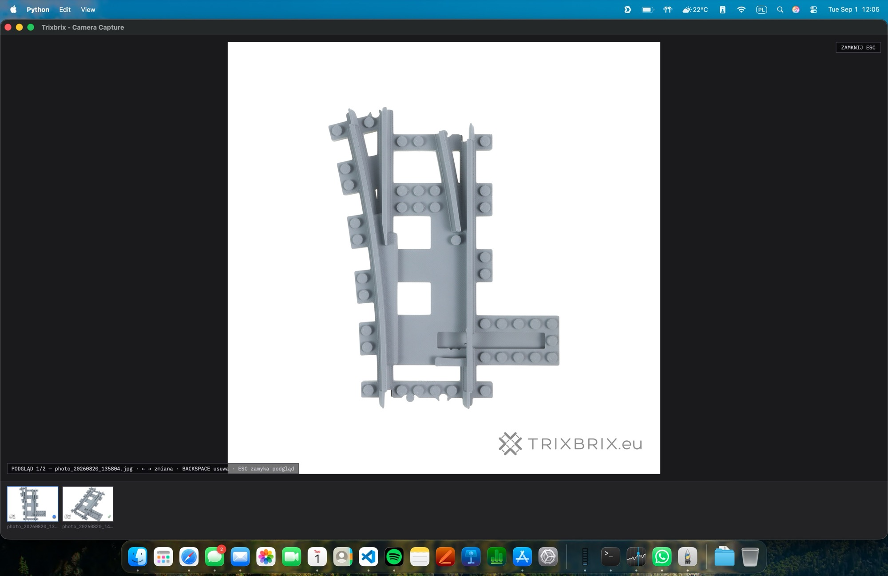

# Camera Capture

A tethered product-photography pipeline for an e-commerce shop.
Hit `ENTER`: a Canon EOS M50 fires, the background is
removed, the product is centered and watermarked, and a 3000×3000 JPEG
lands on disk ready to upload.


The rig, driven from the desktop app (`python3 gui.py`): live view
from the camera with a framing grid, exposure compensation and
post-processing toggles in the sidebar, and the session filmstrip
filling up as you shoot.

## The desktop app

The app talks to the camera directly through the manufacturer's own
SDK — Canon EDSDK on Windows, `libgphoto2` (which speaks Canon's PTP
protocol) on macOS/Linux. No vendor GUI in the middle, no capture folder
being watched: the shutter is fired and the file is pulled over USB by
the app itself, and the live view is streamed from the sensor into the
window.

The window itself is [pywebview](https://pywebview.flowrl.com/): a
native OS window (WKWebView on macOS, WebView2 on Windows) with the
system title bar, hosting a plain HTML/CSS/vanilla-JS frontend — no
Qt, no Tk, no Electron, no JS framework, and no network dependencies
(even the font is bundled). Behind it runs a small stdlib HTTP server
bound to `127.0.0.1` on a random port with a per-launch token, which
serves the static files, streams the live view as MJPEG, and exposes a
state poll plus an action endpoint the UI calls. That split keeps the
camera, image pipeline and robot arm in Python threads, while the UI is
just a web page — `python3 gui.py --browser` opens the very same UI in
a regular browser, which is also the fallback when pywebview isn't
installed.



The start screen lists every photo session from the shop's back office,
grouped by day, with the newest shot of each session as its cover. Start typing to
filter, `ENTER` opens the highlighted session — or type a new product
name to start a fresh one.



Inside a session: live view with the 6×4 framing grid, a "background OK"
badge measured from the frame edges, exposure compensation next to it,
and the post-processing toggles in the sidebar. Photos already in the
session (including ones shot on another machine and pulled back from
the shop's back office) show up in the filmstrip at the bottom.



`SPACE` opens the review mode: the processed 3000×3000 result full
window, `←`/`→` to move between shots, `BACKSPACE` to delete one (it goes
to a local trash and is removed from the catalog app as well), `ESC` back to live view.

## Why I built this

Every new product in an online shop needs catalog photos: clean white
background, centered, consistent crop, watermarked. Doing this by hand
in Lightroom for a batch of products eats a chunk of time. I wanted
three keystrokes and a coffee instead.

## How fast it is

The three photos in `assets/readme/buffer_stop_*.jpg` were captured in a
single session in **about 20 seconds**. Each cycle (shutter, USB
download, background removal, center, watermark, save) takes roughly
seven seconds on a MacBook Pro with an M4 chip. I rotate the product on
the turntable between shots and press ENTER. That is the whole loop.

## Before / after

Raw images are straight off the 24 MP sensor. Processed ones are what
the tool writes: 3000×3000, white background, centered, watermarked.
Note the third shot was intentionally taken at an angle. The pipeline
does *not* "straighten" it, because a three-quarter view is exactly
what you want on a product page.

| Raw | Processed |
|---|---|
|  |  |
|  |  |
|  |  |

## How it works

One pass, full sensor resolution, one final resize. No SaaS calls,
nothing leaves the machine.

1. The camera SDK (`libgphoto2` on macOS/Linux, Canon EDSDK on Windows)
   triggers the shutter and pulls a 6000×4000 JPEG over USB.
2. `rembg` (model `u2netp`) runs locally on CPU and produces an alpha
   mask.
3. Small mask blobs (dust, paper edges) are filtered out by area.
4. Shadows visible *through gaps in the product* are lifted to white,
   while the gray plastic body itself is left alone.
5. Bounding box, square crop with a fixed margin, resize to 3000×3000.
6. Unsharp mask on the product only, never on the background, so no
   halo on alpha edges.
7. Semi-transparent `TRIXBRIX.eu` watermark in the bottom right.
8. Both the raw camera JPEG and the final 3000×3000 are saved to
   `photos/<product-name>/`.
9. Optionally, the processed JPEG is pushed straight to the shop's
   back-office app over a token-authenticated HTTP API, so its
   photo-studio view updates live as you shoot. The raw stays
   local — only the finished file goes over the wire.

## Run it

```bash
source .venv/bin/activate
python3 gui.py
```

On Windows there is a packaged `.exe` instead — see `WINDOWS.md`.

Keys inside a session:

- `ENTER` take a shot
- `SPACE` review mode (`←`/`→` browse, `BACKSPACE` delete, `ESC` back)
- `ESC` leave the session (back to the session list)
- `⌘1` / `⌘2` move the robot arm to the top-down / 3/4 shot

The arm is a Waveshare RoArm-M2-S with a fifth bus servo added at the end
of the boom to tilt the camera, so one placement of the product yields both
the top-down and the 3/4 shot. The stock firmware only knows servos 11–15;
`firmware/roarm_m2_ext_servo/` carries the small patch (commands 130–134)
that drives the extra servo, with flashing instructions.

Background removal is always on — there is no toggle. The raw camera
JPEG is saved next to the processed one, so if `rembg` ever botches a
shot you still have the untouched original.

Re-process an existing file without the camera:

```bash
python3 main.py --input some_photo.jpg --name my_product
```

Pass `--no-upload` to skip the catalog upload for a one-off run, or
unset `AUTOMAT_TOKEN` to disable it permanently. `main.py` without
`--input` is the older terminal UI (macOS/Linux only) — still works,
but the desktop app is the one that gets used.

## Optional: upload to the catalog app

The capture loop can push each processed JPEG to the shop's back-office
app — a Rails service I call "Automat", hence the `AUTOMAT_*` variables
below. The product folder name maps to a product
record on the Rails side; sessions are deduplicated per product per day,
so restarting the script keeps appending to the same gallery.

Copy `.env.example` to `.env` and fill in:

```
AUTOMAT_URL=http://localhost:3000
AUTOMAT_TOKEN=<bearer token from Rails credentials>
AUTOMAT_UPLOAD_ENABLED=true
```

When the token is set, upload is on by default. The shutter announces
the filename to the catalog app first (so its UI shows a spinner
placeholder immediately), then the local pipeline runs, then the processed JPEG is
attached to that record.

## Stack

Python 3.12 + `python-gphoto2` (macOS/Linux) or Canon EDSDK via
`ctypes` (Windows) for camera control, `pywebview` for the desktop
window (native webview + a stdlib HTTP backend, frontend in plain
HTML/JS), `rembg`, `onnxruntime`, `Pillow`,
`numpy`, `scipy.ndimage`, `rich`, plus `requests` and `python-dotenv`
for the optional catalog upload. No GPU, no cloud inference, runs
offline (the upload is the only network hop, and it's local-LAN by
default).
