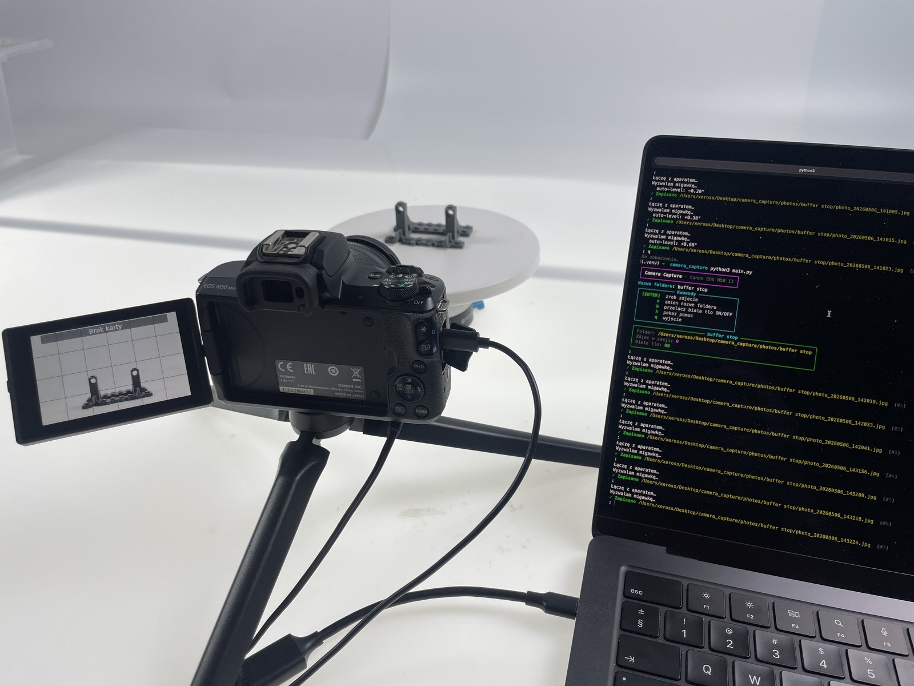
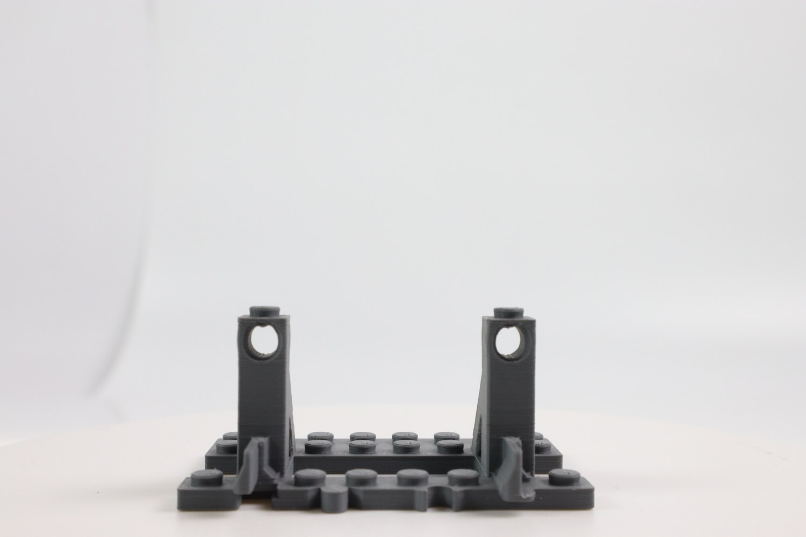
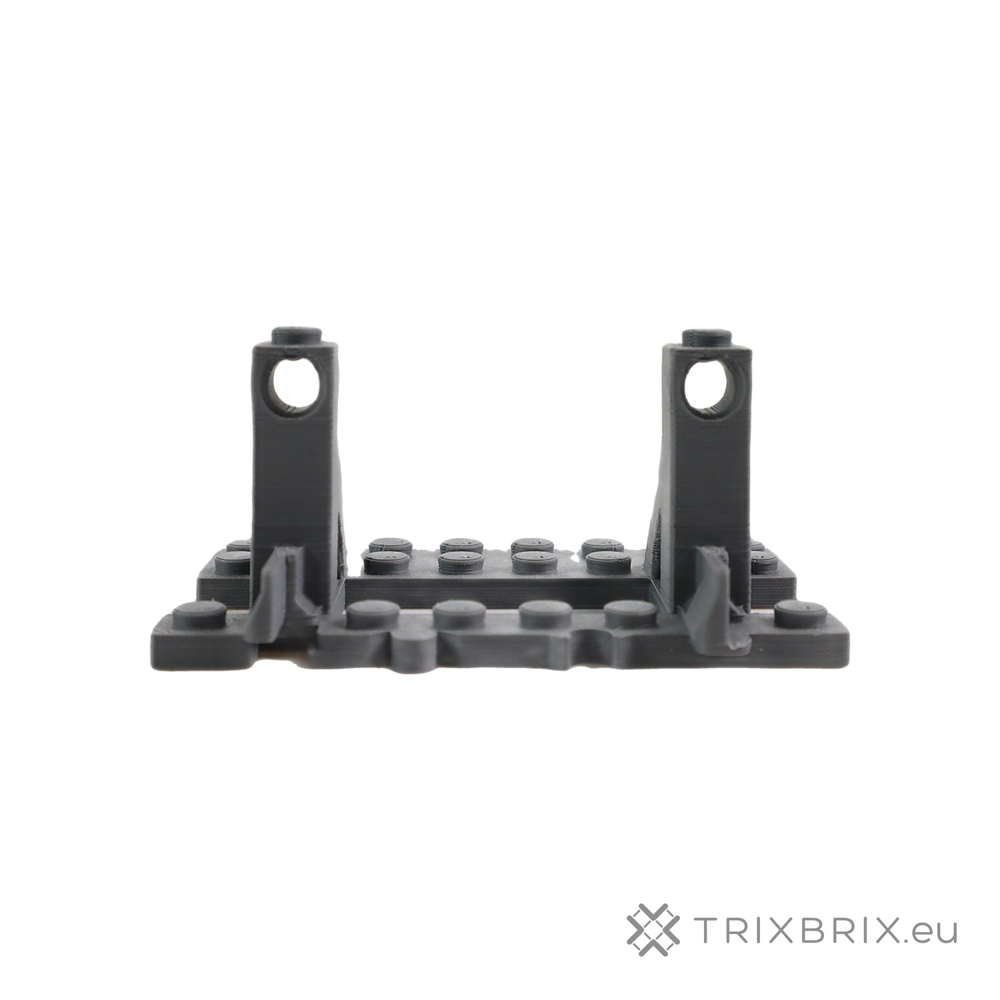
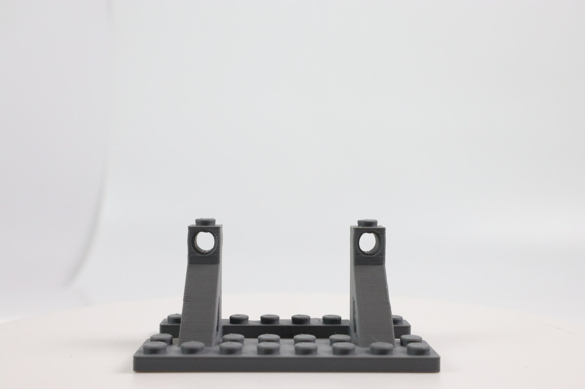
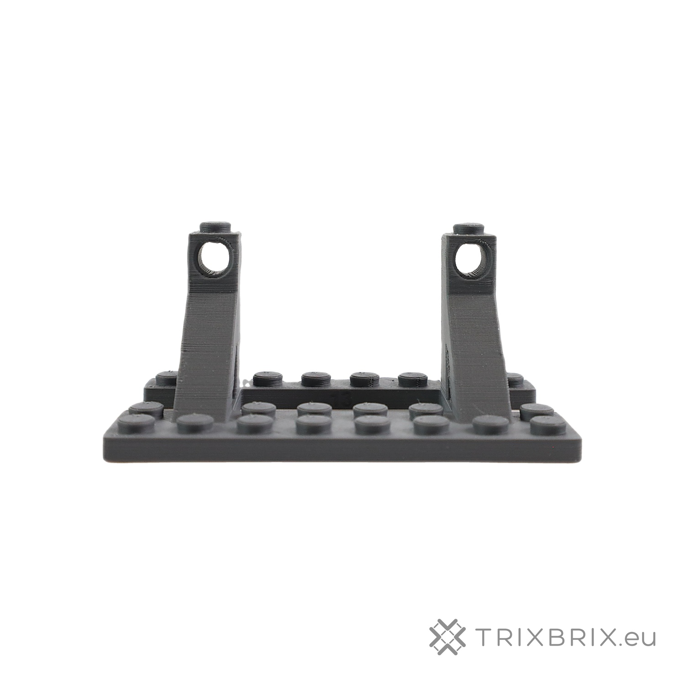
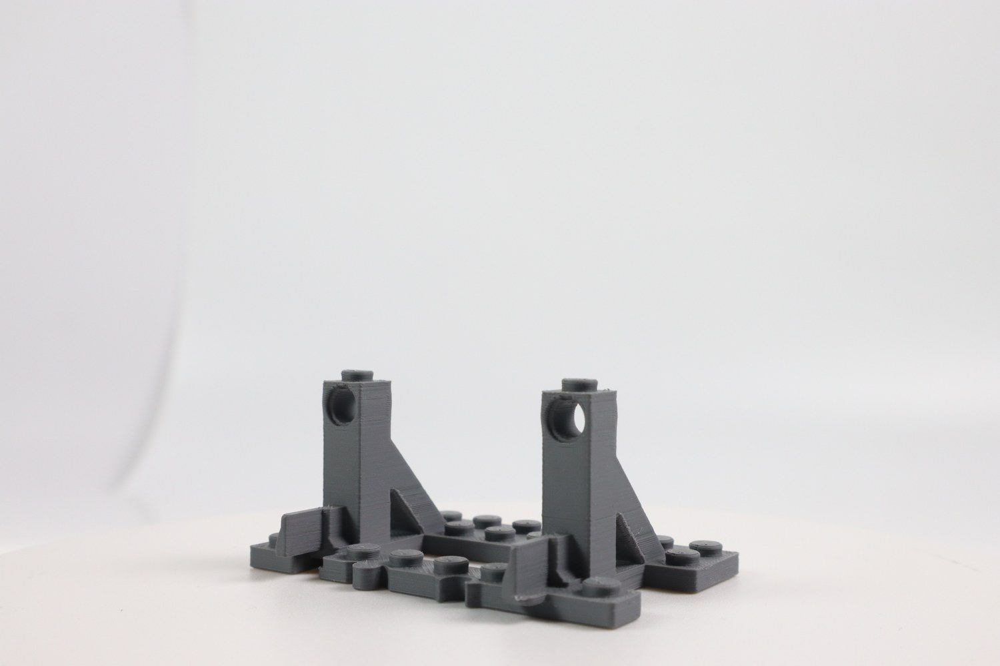
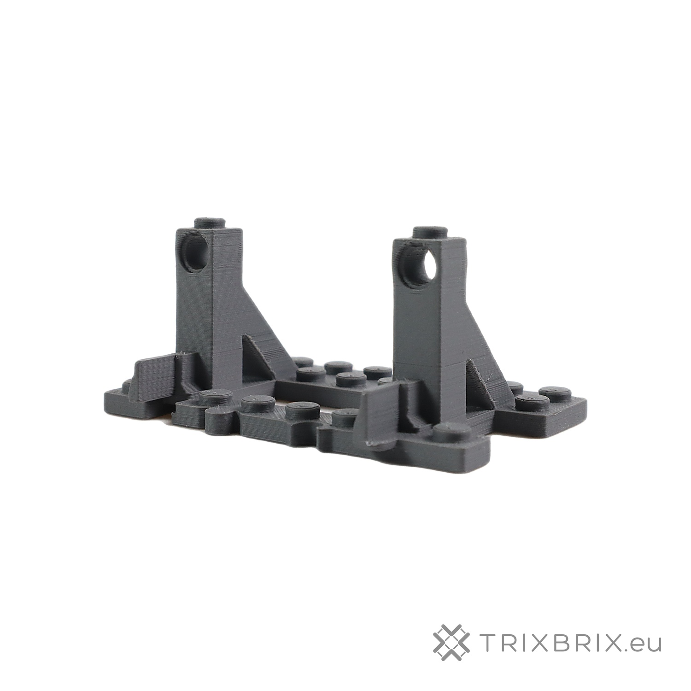

# Camera Capture

A tethered product-photography pipeline for an e-commerce shop.
Hit `ENTER` in the terminal: a Canon EOS M50 fires, the background is
removed, the product is centered and watermarked, and a 1500×1500 JPEG
lands on disk ready to upload.



## Why I built this

Every new product in an online shop needs catalog photos: clean white
background, centered, consistent crop, watermarked. Doing this by hand
in Lightroom for a batch of products eats a chunk of time. I wanted
three keystrokes and a coffee instead.

## How fast it is

The three photos in `assets/readme/buffer_stop_*.jpg` were captured in a
single session in **about 20 seconds**. Each cycle (shutter, USB
download, background removal, center, watermark, save) takes roughly
seven seconds on a MacBook Pro with an M4 chip. I rotate the product on
the turntable between shots and press ENTER. That is the whole loop.

## Before / after

Raw images are straight off the 24 MP sensor. Processed ones are what
the tool writes: 1500×1500, white background, centered, watermarked.
Note the third shot was intentionally taken at an angle. The pipeline
does *not* "straighten" it, because a three-quarter view is exactly
what you want on a product page.

| Raw | Processed |
|---|---|
|  |  |
|  |  |
|  |  |

## How it works

One pass, full sensor resolution, one final resize. No SaaS calls,
nothing leaves the machine.

1. `gphoto2` triggers the shutter and pulls a 6000×4000 JPEG over USB.
2. `rembg` (model `u2netp`) runs locally on CPU and produces an alpha
   mask.
3. Small mask blobs (dust, paper edges) are filtered out by area.
4. Shadows visible *through gaps in the product* are lifted to white,
   while the gray plastic body itself is left alone.
5. Bounding box, square crop with a fixed margin, resize to 1500×1500.
6. Unsharp mask on the product only, never on the background, so no
   halo on alpha edges.
7. Semi-transparent `TRIXBRIX.eu` watermark in the bottom right.
8. Both the raw camera JPEG and the final 1500×1500 are saved to
   `photos/<product-name>/`.
9. Optionally, the processed JPEG is pushed straight to a companion
   Rails app ("Automat") over a token-authenticated HTTP API, so the
   shop's photo-studio view updates live as you shoot. The raw stays
   local — only the finished file goes over the wire.

## Run it

```bash
source .venv/bin/activate
python3 main.py
```

Interactive controls:

- `ENTER` take a shot
- `n` change the session name (also opens a new Automat session)
- `u` toggle upload to Automat
- `q` quit

Background removal is always on — there is no toggle. The raw camera
JPEG is saved next to the processed one, so if `rembg` ever botches a
shot you still have the untouched original.

Or re-process an existing file without the camera:

```bash
python3 main.py --input some_photo.jpg --name my_product
```

Pass `--no-upload` to skip the Automat upload for a one-off run, or
unset `AUTOMAT_TOKEN` to disable it permanently.

## Optional: upload to Automat (Rails)

The capture loop can push each processed JPEG to a companion Rails app
that hosts the catalog. The product folder name maps to a product
record on the Rails side; sessions are deduplicated per product per day,
so restarting the script keeps appending to the same gallery.

Copy `.env.example` to `.env` and fill in:

```
AUTOMAT_URL=http://localhost:3000
AUTOMAT_TOKEN=<bearer token from Rails credentials>
AUTOMAT_UPLOAD_ENABLED=true
```

When the token is set, upload is on by default. The shutter announces
the filename to Automat first (so the UI shows a spinner placeholder
immediately), then the local pipeline runs, then the processed JPEG is
attached to that record.

## Stack

Python 3.12 + `python-gphoto2`, `rembg`, `onnxruntime`, `Pillow`,
`numpy`, `scipy.ndimage`, `rich`, plus `requests` and `python-dotenv`
for the optional Automat upload. No GPU, no cloud inference, runs
offline (the upload is the only network hop, and it's local-LAN by
default).
